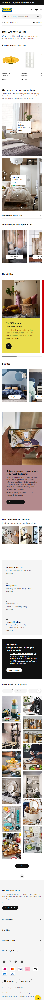
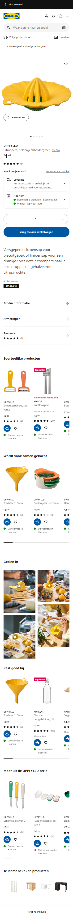

# Procesverslag
Markdown is een simpele manier om HTML te schrijven.  
Markdown cheat cheet: [Hulp bij het schrijven van Markdown](https://github.com/adam-p/markdown-here/wiki/Markdown-Cheatsheet).

Nb. De standaardstructuur en de spartaanse opmaak van de README.md zijn helemaal prima. Het gaat om de inhoud van je procesverslag. Besteedt de tijd voor pracht en praal aan je website.

Nb. Door *open* toe te voegen aan een *details* element kun je deze standaard open zetten. Fijn om dat steeds voor de relevante stuk(ken) te doen.

## Jij

  
uitwerken voor kick-off werkgroep

  ### Auteur:
  Bregtje de Mes

  #### Je startniveau:
  Rood

  #### Je focus:
  Surface plane (& zo responsive als ik tijd voor heb)
 

## Je website

  
uitwerken voor kick-off werkgroep

  ### Je opdracht:
  https://www.ikea.com/nl/nl/

  #### Screenshot(s) van de eerste pagina (small screen): 
  Home
  

  #### Screenshot(s) van de tweede pagina (small screen):
  Productpagina 
  
 

## Toegankelijkheidstest 1/2 (week 1)

  
uitwerken na test in 2e werkgroep

  ### Bevindingen
  Lijst met je bevindingen die in de test naar voren kwamen:

  - Wanneer je door de website tabt begint hij met de header. Dit is wel even door klikken tot je eindelijk bij de main content bent. Wat ook een nadeel is dat hij bij de zoekbalk alles meteen uitklapt waardoor je eerst een aantal voorgestelde zoekopdrachten moet door klikken tot je verder kan.

  - Bij sommige afbeeldingen mist de alt tekst. bij de producten hebben ze wel goed de alt tekst in gevult maar bij voor hun wat minder belangrijke afbeeldingen mist deze tekst soms.

  - Bij de meer lezen links wordt niet uitgelegd waar je meer over kan lezen. 

  - De home pagina heeft geen H1, de zin die je zou verwachten als h1 is als h3 in de html in gezet. Het is wel een zin die niet echt uitlegd waar de pagina overgaat dus het is niet echt h1 materiaal. Hier moet een onzichtbare betere variant voor komen.

  - In de website word op sommige plekken gebruik gemaakt van span ipv button. Het zijn dan elementen die eigenlijk een button hadden moeten zijn.

  - De IKEA site heeft geen dark mode.

## Breakdownschets (week 1)

  
uitwerken na afloop 3e werkgroep

  ### de hele pagina: 
  

  ### dynamisch deel (bijv menu): 
  

  ### wellicht nog een dynamisch deel (bijv filter): 
  

## Voortgang 1 (week 2)

  
uitwerken voor 1e voortgang

  ### Stand van zaken
  hier dit ging goed & dit was lastig (neem ook screenshots op van delen van je website en code)

  ### Agenda voor meeting
  samen met je groepje opstellen

  | Bregtje            | Fleur              | Kenza              | Stella             |
  | ---                | ---                | ---                | ---                |
  | html checken (div) | Javascript         |                    |  uploaden github   |   
  | Hover werkt niet   |                    |                    |  html/css checken  |
  | Webkit scrollbar   |                    |                    |  flexbox           |            

  ### Verslag van meeting
  hier na afloop snel de uitkomsten van de meeting vastleggen

  Mijn punten:
  - div van de punten op de foto's moet button worden. Hier moet je op kunnen klikken.
  - logo in de H1 zetten, dan wordt de alt tekst voor gelezen.
  - Alle links naar de andere pagina die ik maak
  - Menu maken met de oefening
  - in een keer alle foto's 100% width geven. 
  - andere pagina een class geven voor specifieke aanpassingen
  - van niets naar iets kan niet geanimeerd worden dus none naar blok kan niet maar opacity 0 naar 1 kan wel
  - form om zoekveld heen en een button geven
  - nav in header

## Voortgang 2 (week 3)

  
uitwerken voor 2e voortgang

  ### Stand van zaken
  hier dit ging goed & dit was lastig (neem ook screenshots op van delen van je website en code)
  Ik heb deze week niet veel tijd gehad om verder te werken aan mijn code. ik heb een aantal van de feedback puntjes kunnen verwerken:
  ik heb de hover puntjes in buttons veranderd zodat het ook een klikbare knop kan worden. Het logo is nu een h1 zodat dit het eerste kopje is dat de screenreader leest. ook heb ik nu de header onderaan de pagina gezet en met flex boven aan gezet. Zo hoeft iemand met een screenreader niet eerste alle links van het menu door te klikken voordat ze bij de main content zijn. 

  ### Agenda voor meeting
  samen met je groepje opstellen

  | Bregtje            | Fleur              | Kenza              | Sanne (deze week)  |
  | ---                | ---                | ---                | ---                |
  |                    | Hamburger menu     |                    |                    |   
  |                    |                    |                    |                    |
  |                    |                    |                    |                    | 

  ### Verslag van meeting
  hier na afloop snel de uitkomsten van de meeting vastleggen

  Er zijn niet veel punten omdat een paar van ons deze week achterlopen en er is niet heel veel uit dit voortgangs gesprek gekomen qua duidelijke aanpassingen in mijn website.
  Ik heb ook geen aantekeningen gemaakt.

## Toegankelijkheidstest 2/2 (week 4)

  
uitwerken na test in 9e werkgroep

  ### Bevindingen
  Lijst met je bevindingen die in de test naar voren kwamen (geef ook aan wat er verbeterd is):

  - mijn linken en buttons hebben nog niet allemaal geven 

## Voortgang 3 (week 4)

  
uitwerken voor 3e voortgang

  ### Stand van zaken
  ik had de afgelopen week wat moeite met het netjes krijgen van flexbox, ze bepalen zelf hoe breed ze worden naar aanleiding van de inhoud en ik wil ze allemaal even groot hebben binnen een section. 
  Ook vind ik de had ik vaak wat moeite met js, dit was vaak door schoonheidsfoutjes of ergens overheen lezen. 
  vorige week had ik niet echt vragen en daardoor ook niet echt dingen die ik duidelijk moest verbeteren. Ik ben de afgelopen week daardoor gewoon verder gaan werken met waar ik mee bezig was. 

  ### Agenda voor meeting
  samen met je groepje opstellen

  | Bregtje            | Fleur              | Kenza              | Sara (deze week)   |
  | ---                | ---                | ---                | ---                |
  | flex vs. grid      | Github             |                    | Form errors        |
  | flex equal col     | HTML check         |                    | HTML check         |
  | geen img op github |                    |                    |                    | 
  | hoe lang alt tekst |                    |                    |                    | 
  | voor screenreader? |                    |                    |                    | 
  

  ### Verslag van meeting
  hier na afloop snel de uitkomsten van de meeting vastleggen

  - voor wanneer je gelijke kolommen wil kan ik beter grid gebruiken dan flex, dit zal ik dus op meerdere plekken in mijn code moeten aanpassen
  - Ik kreeg de tip om voor de buttons aria labelled by te gebruiken zodat screenreaders dat lezen ipv dat wat er in staat (of niet). dit kan ik ook gebruiken voor de lees meer links
  - ik kan ook gaan kijken naar de screenreader hidden utility class
  - om te zorgen dat mijn afbeeldingen altijd te zien zijn kan ik een picture element gebruiken, hier kan je meerdere keren de zelfde afbeelding zetten met andere file type. zo kan de browser zelf bepalen of welke hij nodig heeft. 
  - Alt tekst moet niet te lang zijn maar wel duidelijk. Details die niet belangrijk zijn kan je weglaten. Je kan ook bij sfeerbeelden de alt teksten weglaten. 

## Eindgesprek (week 5)

  
uitwerken voor eindgesprek

  ### Je uitkomst - karakteristiek screenshots:
  

  ### Dit ging goed/Heb ik geleerd: 
  Korte omschrijving met plaatjes

  

  ### Dit was lastig/Is niet gelukt:
  Korte omschrijving met plaatjes

  

## Bronnenlijst

  
continu bijhouden terwijl je werkt

  Nb. Wees specifiek ('css-tricks' als bron is bijv. niet specifiek genoeg). 
  Nb. ChatGpT en andere AI horen er ook bij.
  Nb. Vermeld de bronnen ook in je code.

  1. De opdrachten uit de les waren mijn grootste bron
  2. 
  3. ...

